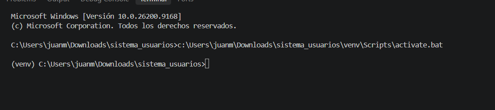
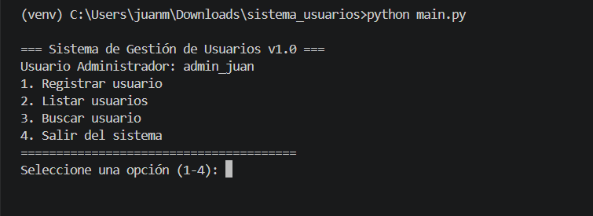

# Sistema Modular de Configuración y Gestión de Usuarios

Este es un proyecto integrador desarrollado en Python que demuestra el uso de entornos virtuales, gestión de dependencias, variables de entorno y arquitectura modular.

## Requisitos Previos

- Python 3.8 o superior instalado.
- Terminal o consola de comandos (ej. terminal de VS Code).

## Instrucciones de Configuración y Ejecución

### 1. Crear y Activar el Entorno Virtual

Para mantener las dependencias aisladas del sistema global, creamos un entorno virtual:

**En Windows:**

```bash
python -m venv venv
venv\Scripts\activate
```

**En macOS/Linux:**

```bash
python3 -m venv venv
source venv/bin/activate
```

### 2. Instalación de Dependencias

```bash
pip install -r requirements.txt
```

### 3. Configuración de Variables de Entorno

Crea un archivo `.env` en la raíz del proyecto (basado en `.env.example`).

### 4. Ejecución del Proyecto

python main.py

### 5. Capturas de pantalla





```


```
